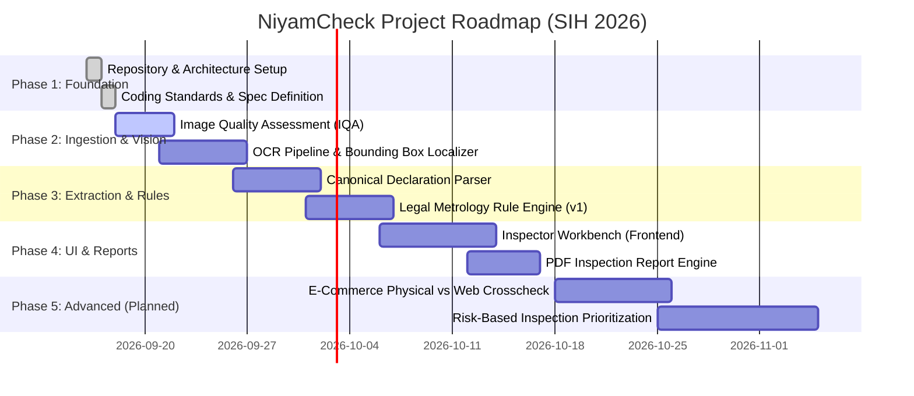

# NiyamCheck (नियमचेक)

> **Automated Legal Metrology Compliance Verification System for Packaged Commodities**  
> *Empowering Enforcement Officers, Protecting Consumer Rights*

[](https://github.com/)
[](https://www.sih.gov.in/)
[](./README.md)
[](./LICENSE)

---

## 📌 Project Metadata

- **Project Name:** NiyamCheck
- **Team Name:** CodeHexa
- **Competition:** Smart India Hackathon (SIH) 2026
- **Problem Statement ID:** SIH26034
- **Problem Statement Title:** Software System to check compliance of Packaged Commodities under the Legal Metrology (Packaged Commodities) Rules, 2011 by scanning products, images and labels.

---

## 🔍 Problem Overview

Under the **Legal Metrology (Packaged Commodities) Rules, 2011** (and its subsequent amendments), every pre-packaged commodity distributed, sold, or offered for sale in India must carry mandatory declarations on its principal display panel and package surfaces. These mandatory declarations include:

1. **Name and Address** of the manufacturer, packer, or importer.
2. **Generic or Common Name** of the commodity contained in the package.
3. **Net Quantity** in standard units of weight, measure, or number.
4. **Month and Year of Manufacture / Packing / Import**.
5. **Maximum Retail Price (MRP)** inclusive of all taxes, with unit sale price where required.
6. **Consumer Care Details** (name, address, telephone number, and email of grievance officer/helpline).
7. **Country of Origin** (for imported goods and e-commerce offerings).
8. **Best Before / Expiry Date** where applicable under relevant product category standards.
9. **Sizes and Dimensions** where relevant for specific commodity classes.

### The Enforcement Challenge

- **Enormous Scale:** Millions of packaged SKUs circulate through physical retail stores, warehouses, and online marketplaces.
- **Manual, Slow Inspection:** Enforcement officers must manually verify small print, font sizes, specific phrasing, and arithmetic consistency across crowded packaging.
- **Subjectivity & Human Error:** Manual checks often miss hidden or poorly printed declarations or lead to inconsistent enforcement disputes.
- **E-Commerce & Digital Gaps:** Verifying compliance across physical packages versus digital catalog listings creates a dual-front challenge.

---

## 💡 Proposed Solution

**NiyamCheck** is an intelligent, open-world compliance verification software platform designed specifically for legal metrology enforcement officers and consumer affairs authorities. 

Rather than functioning as a black-box product catalog, **NiyamCheck operates on first principles**: it assesses the declarations physically present on any product package, maps them against versioned regulatory requirements, and outputs deterministic, evidence-backed verdicts.

### Key Capabilities

1. **Image Quality Assessment (IQA):** Validates uploaded multi-angle package photos for sharpness, glare, resolution, and angle before processing.
2. **Robust Vision & Multi-Engine OCR:** Detects packaging text, stamps, barcode/QR areas, and numeric panels across complex surfaces, curved bottles, foils, and pouches.
3. **Structured Declaration Extraction:** Maps recognized text into canonical regulatory data schemas using domain-specific layout analysis and NER heuristics.
4. **Deterministic, Versioned Rule Engine:** Executes rule checks against the codified Legal Metrology Rules, 2011 without hallucination or hardcoded assumptions.
5. **Nuanced Declaration State Model:** Avoids penalizing products for poor lighting or partial folds by distinguishing between:
   - `PRESENT` — Clearly detected, localized, and parsed.
   - `MISSING` — Verified absence after high-confidence full package scan.
   - `UNCLEAR` — Potential presence detected but OCR confidence/resolution insufficient for legal certainty.
   - `NOT_APPLICABLE` — Exemption or rule not binding for this product category/packaging format.
   - `NOT_VERIFIABLE` — Package face obscured or required contextual view missing.
6. **Auditable Evidence & Bounding-Box Localizer:** Every flagged infraction or passed declaration links directly to visual bounding boxes on the original package image.
7. **Structured Inspection Report Generator:** Generates standardized, tamper-evident PDF inspection reports with visual evidence and statutory citations.
8. **Inspection History & Audit Trail:** Maintains secure case files for enforcement officers and judicial scrutiny.

---

## ⚖️ Core Design Principles

### 1. Open-World Architecture (Not a Closed-Set Classifier)
- The system **never** assumes a closed catalog of products. A brand-new commodity launched yesterday that the system has never seen before can be analyzed with the exact same rigor as any standard commodity.
- Datasets are used strictly for training and validating OCR accuracy, text detection, and layout understanding — **not** for memorizing product names.

### 2. Legal Metrology Rules as the Single Source of Truth
- No legal requirements are invented or assumed.
- Compliance rules are isolated into declarative, versioned rule definitions (`data/legal_rules/`) that can be updated as amendments and notifications are published in the Official Gazette.

### 3. Explainability & Human-in-the-Loop Integrity
- Enforcement actions carry legal and financial consequences. The system does not emit opaque probabilities; it generates structured rationale:
  - **Verdict:** `COMPLIANT` | `NON-COMPLIANT` | `NEEDS_MANUAL_REVIEW`
  - **Evidence:** Exact text snippet, bounding box coordinates, image identifier, and cited Legal Metrology rule/sub-rule.
- If text is illegible or occluded, the system flags `UNCLEAR` / `NEEDS_MANUAL_REVIEW` instead of falsely alleging a missing mandatory declaration.

---

## 🏛️ High-Level Architecture

```
                               ┌──────────────────────────────────────────────┐
                               │             Client Applications              │
                               │  - Modern Web Dashboard (Desktop/Tablet)     │
                               │  - Field Officer Mobile Web Upload Interface │
                               └──────────────────────┬───────────────────────┘
                                                      │ HTTPS / REST API
                                                      ▼
┌─────────────────────────────────────────────────────────────────────────────────────────────────────┐
│                                   Backend API Layer (FastAPI)                                       │
│  - Authentication & Role-Based Access (Enforcement Officer, Supervisor, Admin)                     │
│  - Inspection Job Coordinator & Session Manager                                                     │
│  - Evidence Storage & Inspection Audit Repository                                                   │
└──────────┬──────────────────────────────────────────┬──────────────────────────────────────┬────────┘
           │                                          │                                      │
           ▼                                          ▼                                      ▼
┌───────────────────────┐                  ┌───────────────────────┐              ┌──────────────────┐
│  Image Processing     │                  │  Vision & OCR Engine  │              │  Reporting       │
│  & Quality Validation │                  │  (Multi-Engine/Hybrid)│              │  Engine          │
├───────────────────────┤                  ├───────────────────────┤              ├──────────────────┤
│ - Resolution Check    │                  │ - Text Detection      │              │ - PDF Reports    │
│ - Blur (Laplacian)    │                  │ - Layout Analysis     │              │ - Tamper-evident │
│ - Glare & Lighting    │                  │ - Text Recognition    │              │   audit record   │
│ - Perspective / Crop  │                  │ - Bounding Box Map    │              │ - Summary stats  │
└──────────┬────────────┘                  └──────────┬────────────┘              └──────────────────┘
           │                                          │
           └──────────────────┬───────────────────────┘
                              ▼
┌─────────────────────────────────────────────────────────────────────────────────────────────────────┐
│                              Canonical Information Extraction Layer                                 │
│  - Commodity Generic Name Extractor           - Net Quantity Normalizer (g, kg, ml, L, m, units)    │
│  - Manufacturer / Packer / Importer Parser    - Date Parser (Mfg/Pack/Expiry format validator)      │
│  - Maximum Retail Price (MRP & USP) Matcher   - Consumer Care & Grievance Details Extractor         │
└─────────────────────────────────────────────────────┬───────────────────────────────────────────────┘
                                                      │
                                                      ▼
┌─────────────────────────────────────────────────────────────────────────────────────────────────────┐
│                            Deterministic Regulatory Compliance Engine                               │
│  - Rule Version Resolver (Selects applicable ruleset version based on packing/mfg date)             │
│  - Mandatory Declarations Checker (Rule 6 validation)                                               │
│  - Font Size & Area Proportionality Assessor (Principal Display Panel ratio analysis)               │
│  - Net Quantity Units & Rounding Validator (First/Second Schedule compliance)                       │
│  - Dual-Faceted Unit Sale Price (USP) Validator                                                     │
│  - Decision Matrix: COMPLIANT | NON-COMPLIANT | NEEDS_MANUAL_REVIEW                                 │
└─────────────────────────────────────────────────────┬───────────────────────────────────────────────┘
                                                      │
                                                      ▼
┌─────────────────────────────────────────────────────────────────────────────────────────────────────┐
│                              Database & Versioned Rule Store                                        │
│  - Relational Database (Inspection Sessions, Evidence BBoxes, Verdicts, Audit Trails)               │
│  - Versioned Legal Rules Repository (Declarative JSON/YAML rule schemas & statutory references)     │
└─────────────────────────────────────────────────────────────────────────────────────────────────────┘
```

---

## 📦 Repository Structure

```
NiyamCheck/
│
├── backend/                  # FastAPI REST API, inspection workflows, pipelines
├── frontend/                 # React/TypeScript modern web application for inspectors
├── data/
│   ├── legal_rules/          # Versioned statutory rule definitions & gazette specs
│   ├── product_images/       # Packaged commodity test images (multi-angle views)
│   ├── annotations/          # Ground truth declaration annotations for benchmarks
│   └── test_cases/           # Synthetic & edge-case compliance test fixtures
│
├── docs/                     # Architecture, specifications, legal citations, dev guides
├── models/                   # Model configuration, weights, and fine-tuning artifacts
├── notebooks/                # Experimental exploration (OCR benchmarks, layout testing)
├── tests/                    # Unit, integration, and rule engine validation suites
│
├── .gitignore                # Comprehensive Git exclusions for Python/Node/Data
├── LICENSE                   # MIT Open-Source License
└── README.md                 # Project root documentation (this file)
```

---

## 🧩 Planned Modules

| Module | Purpose | Location |
|---|---|---|
| **Image Ingestion & IQA** | Assesses image suitability, checks glare, lighting, and blur before OCR. | `backend/app/cv/iqa/` |
| **OCR & Vision Abstraction** | Extracts text and bounding boxes using a pluggable multi-engine pipeline. | `backend/app/cv/ocr/` |
| **Declaration Parser** | Normalizes raw OCR tokens into structured Legal Metrology declaration fields. | `backend/app/extractors/` |
| **Compliance Rule Engine** | Evaluates parsed declarations against codified Legal Metrology rules. | `backend/app/rules_engine/` |
| **Inspection & Case Management** | Coordinates inspection lifecycles, persists verdicts, and tracks audit trails. | `backend/app/services/` |
| **Report Generator** | Produces exportable inspection reports with bounding-box evidence overlays. | `backend/reporting/` |
| **Inspector Workbench (UI)** | Interactive web console for uploading images, reviewing flags, and confirming evidence. | `frontend/src/` |

---

## 🚀 Recommended Technology Stack (Team CodeHexa)

Designed specifically for an agile, 6-member student hackathon team balancing speed, robustness, and scientific rigor:

| Tier | Recommended Technology | Rationale & Why |
|---|---|---|
| **Backend API** | **FastAPI (Python 3.10+)** | Native interoperability with Python CV/ML libraries; high async throughput; automatic OpenAPI docs; strong schema validation via Pydantic. |
| **Computer Vision / IQA** | **OpenCV (`opencv-python-headless`) + NumPy** | Standard, fast, CPU-efficient blur (Laplacian variance), glare mask detection, and contour analysis. |
| **OCR Engine** | **PaddleOCR / RapidOCR / Tesseract** (abstracted interface) | High accuracy on wild text, rotated labels, and diverse packaging fonts. Abstracted behind a standard interface to allow seamless plug-in of vision-language models. |
| **Information Extraction** | **Rule-based regex parsers + Layout-aware heuristics + Optional Mini-LLM/Spacy** | Critical numeric fields (MRP, dates, quantities) require exact deterministic pattern matching; entity clustering extracts complex addresses. |
| **Compliance Rule Engine** | **Pure Python Declarative Engine (YAML/JSON Rules)** | Ensures deterministic explainability, auditability, zero hallucinations, and easy versioning without black-box logic. |
| **Database** | **PostgreSQL (Prod) / SQLite (Local Dev)** | SQLAlchemy ORM allows zero-setup SQLite during early development, seamlessly transitioning to PostgreSQL for multi-user inspection storage. |
| **Web Frontend** | **React + Vite + Tailwind CSS + Lucide Icons** | Ultra-fast build times, rich UI ecosystem, responsive design for tablet/mobile inspection in the field, and easy canvas/SVG bounding box overlays. |
| **Report Generation** | **ReportLab / WeasyPrint** | Generates clean, tamper-evident PDF inspection reports with embedded evidence crops. |
| **Testing** | **Pytest + Pytest-Mock** | Fast test execution for compliance rules, parsing edge cases, and API endpoints. |

---

## 🗺️ Development Roadmap



- **Phase 1: Project Foundation (Current Milestone)**
  - Repository structure, directory isolation, git hygiene, technology blueprint, architecture specification.
- **Phase 2: Ingestion & Vision Pipeline**
  - Image quality filtering (blur/glare detection), multi-engine OCR abstraction, bounding box mapping.
- **Phase 3: Canonical Parsing & Rule Engine**
  - Extract MRP, net quantity, dates, manufacturer, consumer care; verify against Legal Metrology Rules, 2011.
- **Phase 4: Inspector UI & Reporting**
  - Modern web dashboard, visual evidence inspector, PDF report generator.
- **Phase 5: Evaluation & Field Hardening**
  - Benchmark against complex real-world packaging (curved bottles, foil wraps, multi-language packs).

---

## 🔮 Advanced Features (Planned / Future Work)

The following features are designed into the long-term architecture and will be tackled in subsequent milestones:

1. **Physical-Package vs Online-Listing Cross-Check:** Automated crawler comparing physical package declarations with e-commerce product detail pages (Amazon, Flipkart, Blinkit, Zepto, etc.) to detect e-commerce declaration non-compliance.
2. **Risk-Based Inspection Prioritization:** Predictive analytics highlighting brands, manufacturers, or commodity categories with high historical violation rates to optimize field officer deployment.
3. **Regulatory-Change Impact Analysis:** Simulation engine to test how proposed legal metrology amendments would affect existing compliant/non-compliant product distributions.
4. **Multilingual & Indic Script Support:** Specialized OCR and extraction for mandatory declarations printed in regional Indian languages.
5. **Offline-First Mobile PWA:** Progressive Web App with edge-optimized quantized OCR for remote field inspections with low or no connectivity.

---

## 🚦 Current Status

- **Status:** **Milestone 7 Complete — Final Integration, Real-World Validation & SIH Demo Readiness**
  - **Milestone 1:** OCR, Image Quality Assessment (IQA), Structured Field Extraction (Complete)
  - **Milestone 2:** Deterministic Legal Metrology Compliance Rule Engine (Complete)
  - **Milestone 3:** Evidence Mapping, Multi-Angle Session Aggregation, PDF/JSON Reports (Complete)
  - **Milestone 4:** Authoritative Legal Knowledge Base, BM25 Statutory Retrieval & Grounded Explanations (Complete)
  - **Milestone 5:** Responsive React + Vite Inspector Frontend with Bounding Box Evidence Viewer, Legal Search, and Report Downloader (Complete)
  - **Milestone 6:** Real-World Hardening, PWA Web Manifest & Service Worker Shell Caching (Strict API Bypass), Mobile Camera Capture (`capture="environment"`), Client-Side Image Downscaling, IndexedDB Offline Draft Persistence, Duplicate Submission Protection, and Responsive Card Views (Complete)
  - **Milestone 7:** Dedicated End-to-End Integration Test Suite, Real-World Failure Mode Validation (Corrupt, Empty, Oversized, and Degraded Scans), Coordinate Clamping, and Full SIH Demonstration Sequence (Complete)

- **Test Suite Status:**
  - **Backend:** **139 tests passing (0 failures)** via Python `unittest`
  - **Frontend:** **23 tests passing (0 failures)** via Node test runner, Vite production build passing

---

## 🔄 End-to-End Inspection Pipeline

```
┌─────────────────┐     ┌──────────────────────┐     ┌──────────────────────┐
│  Product Images │ ──► │ Image Quality (IQA)  │ ──► │     Vision / OCR     │
│ (Camera/Upload) │     │  (Blur/Glare/Format) │     │   (Text & Regions)   │
└─────────────────┘     └──────────────────────┘     └──────────┬───────────┘
                                                                │
                                                                ▼
┌─────────────────┐     ┌──────────────────────┐     ┌──────────────────────┐
│ Multi-Panel     │ ◄── │  Evidence Mapping    │ ◄── │ Open-World Field     │
│ Aggregator      │     │  (BBoxes & Panels)   │     │ Extraction (Rule 6)  │
└────────┬────────┘     └──────────────────────┘     └──────────────────────┘
         │
         ▼
┌─────────────────┐     ┌──────────────────────┐     ┌──────────────────────┐
│ Deterministic   │ ──► │ Authoritative Legal  │ ──► │  Inspection Report   │
│ Rule Engine     │     │ Knowledge Base (RAG) │     │      (PDF/JSON)      │
└─────────────────┘     └──────────────────────┘     └──────────────────────┘
```

1. **Product Images:** Mobile camera capture (`capture="environment"`) or multi-panel gallery upload (Front, Back, Sides, Top, Bottom).
2. **Image Validation & Optimization:** Client-side canvas downscaling (max 1920px) and backend IQA check.
3. **OCR:** Extracts detected text lines and normalized bounding regions `[ymin, xmin, ymax, xmax]`.
4. **Open-World Field Extraction:** Structured pattern matching for product name, net quantity, MRP, manufacturer, address/PIN, date, consumer care, and country of origin without assuming a closed product catalog.
5. **Evidence Mapping:** Direct traceability from extracted values to localized visual packaging bounding boxes.
6. **Multi-Image Aggregation:** Resolves declarations across panels, selecting verified presence and highest OCR confidence.
7. **Deterministic Compliance Rule Engine:** Audits declarations against codified Legal Metrology Rules, 2011; emits conservative verdicts (`COMPLIANT`, `NON_COMPLIANT`, `PARTIALLY_VERIFIABLE`, `NOT_VERIFIABLE`).
8. **Authoritative Legal Retrieval (RAG):** Deterministically attaches official Government of India Gazette citations from the Department of Consumer Affairs.
9. **Inspection Report Generation:** Produces downloadable audit-grade JSON reports with SHA-256 hashes and high-resolution PDF inspection reports.

---

## ⚠️ System Limitations & Realistic Operational Boundaries

In accordance with legal metrology standards and audit integrity:
1. **Observable Declarations Only:** The system evaluates observable declarations printed on packaging surfaces. It does not certify internal contents or physical product composition.
2. **Photographed Faces:** Unphotographed packaging surfaces are conservatively classified as `NOT_VERIFIABLE` rather than legally missing.
3. **Physical Font Proportionality:** Exact font heights relative to Principal Display Panel (PDP) area cannot be verified without physical measuring instruments or calibrated physical scales.
4. **OCR Degradation:** Heavily folded, torn, crinkled, or severely blurred packaging may yield `UNCLEAR` or `NOT_VERIFIABLE` evaluations requiring field officer review.
5. **Connectivity Requirements:** Offline functionality supports local IndexedDB draft preparation; compliance analysis and legal retrieval require a connection to the FastAPI backend.
6. **Regulatory Scope:** Strictly codified for Rule 6(1) and Rule 9 of the Legal Metrology (Packaged Commodities) Rules, 2011, Section 18 of the Legal Metrology Act, 2009, and the 2021/2022 amendments (G.S.R. 779(E), G.S.R. 226(E)). Does not evaluate FSSAI, BIS, drug, or cosmetic regulations.
7. **Statutory Status:** Provides automated regulatory assistance; does not substitute for judicial determinations or official legal or enforcement determinations.

---

## 📱 Progressive Web App (PWA) & Mobile Inspection

NiyamCheck includes full Progressive Web App (PWA) and mobile inspection field capabilities:
1. **Standalone PWA Installability:** Installable to mobile and desktop home screens with official scales branding, theme colors, and maskable icons.
2. **Offline App Shell Caching:** Service Worker (`sw.js`) precaches static shell assets with stale-while-revalidate strategy.
3. **Strict API Pass-Through:** Zero caching or offline persistence of private inspection payloads or confidential compliance verdicts — `/api/` calls always pass straight to the network.
4. **Offline Session Drafts (IndexedDB):** Inspectors can capture photos and prepare multi-angle inspection drafts even without connectivity; drafts persist locally in browser IndexedDB.
5. **Mobile Camera Capture:** Direct device camera trigger with `capture="environment"` and gallery picker fallback.
6. **Client-Side Image Optimization:** Automatically downscales heavy 48MP/12MP mobile camera shots to 1920px before upload to conserve field bandwidth while preserving OCR sharpness.
7. **Network Awareness & Diagnostics:** Live online/offline status detection, sticky offline warning banner, and modal for backend, RAG, and storage diagnostics.
8. **Mobile-Responsive Inspection Views:** Dual layout with desktop data tables and mobile stacked cards, touch-friendly 44px tap targets, and collapsible navigation drawer.

---

## 🚀 Quickstart & Running the Application

### 1. Start the FastAPI Backend

```bash
# From repository root
.venv/bin/python -m uvicorn backend.main:app --host 0.0.0.0 --port 8000 --reload
```
- API Base: `http://localhost:8000`
- Interactive Swagger Documentation: `http://localhost:8000/docs`
- Health Endpoint: `http://localhost:8000/api/v1/health`

### 2. Start the React + Vite Frontend

```bash
cd frontend
npm install
npm run dev
```
- Web Application: `http://localhost:5173`

### 3. Run Automated Tests

```bash
# Backend Test Suite (139 tests)
.venv/bin/python -m unittest discover -s tests -p "test_*.py"

# Frontend Test Suite (23 tests)
cd frontend && npm test

# Frontend Production Build Verification
cd frontend && npm run build
```

---

## 👥 Team CodeHexa

Developed with pride for **Smart India Hackathon 2026** (Problem Statement: **SIH26034**).


